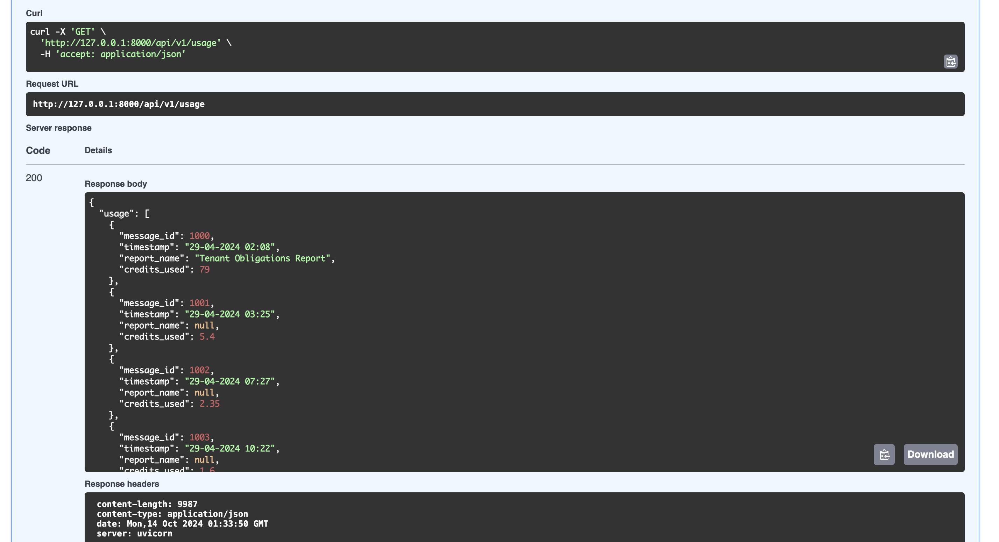
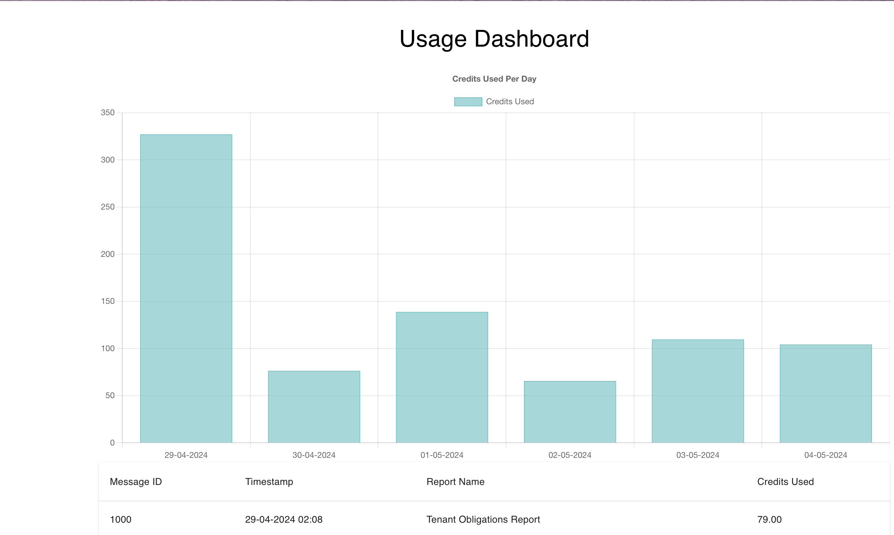

# Orbital Witness App

## Overview
Orbital Witness take home test

A full-stack application built with **FastAPI** for the backend and **React** for the frontend. The application provides an API for retrieving usage data and displays it in a user-friendly dashboard, featuring a table and a bar chart.

## Features

- User-friendly dashboard with usage data visualization
- Bar chart displaying usage statistics
- RESTful API for data retrieval





## Technologies

- **Backend**: FastAPI, Uvicorn
- **Frontend**: React, Material-UI
- **Package Managers**: npm, pip

## Installation

## Prerequisites

Make sure you have the following installed:

- Python 3.12.0
- Node.js and npm

### Clone the Repository

```bash
git clone https://github.com/simtb2/orbital_witness.git
cd orbital-witness-app
cd backend
